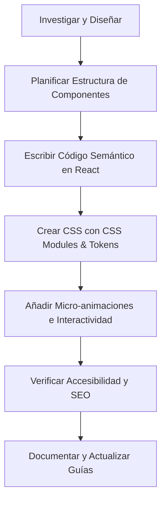

# SuckIt — Guía de Desarrollo y Diseño Frontend

Esta guía establece los estándares de calidad visual, arquitectura de software y procesos técnicos que rigen la interfaz de usuario de **SuckIt**. Sirve como la "fuente de verdad" tanto para desarrolladores humanos como para agentes de inteligencia artificial que colaboren en el frontend.

---

## 1. Principios de Diseño e Identidad Visual

SuckIt utiliza una estética de **modo oscuro de alta fidelidad** basada en tonos profundos HSL, gradientes vibrantes (Violeta/Cian) y efectos de glassmorphic ("cristal esmerilado"). Todo diseño debe sentirse sofisticado, interactivo y moderno.

### Paleta de Colores (Definida en `globals.css`)
- **Fondo Principal:** `var(--bg-primary)` (HSL profundo y oscuro).
- **Contenedores y Tarjetas:** `var(--bg-surface)` y `var(--bg-surface-hover)`.
- **Acentuaciones (Gradients):**
  - Primario (Violeta): `var(--accent-primary)` (para acciones clave y estados activos).
  - Secundario (Cian): `var(--accent-secondary)`.
  - Gradiente de Acción: `var(--accent-gradient)` (mezcla fluida de violeta a cian).
- **Textos:**
  - Principal (Lectura limpia): `var(--text-primary)` (HSL blanco suave).
  - Secundario (Descripciones/Soporte): `var(--text-secondary)`.
  - Terciario (Placeholders/Desactivados): `var(--text-tertiary)`.

### Efectos Glassmorphic (Estilo de Cristal)
Para elementos de navegación (Navbar), modales y selectores elevados, se debe usar la clase `.glass`:
```css
.card-glass {
  background: hsla(225, 18%, 13%, 0.6);
  backdrop-filter: blur(20px) saturate(1.2);
  -webkit-backdrop-filter: blur(20px) saturate(1.2);
  border: 1px solid var(--border-subtle);
}
```

### Animaciones y Transiciones Fluidas
Cada interacción interactiva debe reaccionar de manera inmediata pero suave.
- **Acciones Rápidas (Píldoras/Enlaces):** `transition: all var(--transition-fast)`.
- **Botones y Clics Principales:** `transition: all var(--transition-base)`.
- **Efectos de Rebote (Springs) en Entradas/Toasts:** `animation: toast-in var(--transition-spring)`.
- **Efectos de Elevación e Interacción:** Las píldoras (`.pill`), tarjetas de pasos, y tarjetas de características se elevan sutilmente en hover (`transform: translateY(-2px)`) y reducen su escala ligeramente al hacer clic (`transform: scale(0.96)`) usando transiciones de tipo spring.

### Fondo Premium y Textura de Cuadrícula
- **Cuadrícula Tecnológica:** Se genera dinámicamente mediante `body::before` usando un patrón repetitivo `linear-gradient` suavizado a `hsla(225, 20%, 55%, 0.08)`.
- **Vigñeta de Enfoque:** El fondo de cuadrícula se difumina hacia los bordes mediante una máscara radial (`mask-image`), concentrando la nitidez en el centro de los elementos de interacción.
- **Gradientes de Aurora Flotantes:** Múltiples contenedores `.aurora-blob` (primary, secondary, tertiary) con desenfoque de 80px y mezcla de pantallas (`mix-blend-mode`) flotan de manera animada e infinita en el fondo para crear profundidad tridimensional dinámica.

### Resplandores de Marca Personalizados (Neon Glows)
En la sección de plataformas soportadas, cada tarjeta (`.platformCard`) cuenta con un efecto de iluminación único adaptado al color oficial de la red social (ej. YouTube, TikTok, Instagram, X). Al interactuar con la tarjeta (hover/focus), la tarjeta se eleva y proyecta una sombra de resplandor neón difuminada con el tono exacto de su logotipo.

---

## 2. Pautas Técnicas: Next.js 16 & React 19

El proyecto utiliza Next.js 16 (App Router) y React 19. Es mandatorio alinearse con la estructura y las convenciones del framework.

### Componentes de Servidor vs. Cliente
1. **Server Components por Defecto:** Mantén los componentes de maquetado, SEO y páginas de presentación como Server Components para optimizar el rendimiento y el SEO del sitio.
2. **Client Components Explícitos:** Usa `'use client'` al principio del archivo *únicamente* cuando el componente requiera:
   - Hooks de estado (`useState`, `useReducer`).
   - Ciclos de vida (`useEffect`, `useCallback`, `useMemo`).
   - Interactividad directa del navegador (manejo de clics, inputs de usuario).
   - Consumo de eventos en tiempo real.

### Estructura de Componentes
Los componentes deben colocarse dentro de la carpeta `components/` y usar estilos estructurados y aislados.
- Cada componente `.tsx` debe tener su archivo de estilo correspondiente `.module.css`.
- Evita importar `globals.css` directamente en componentes; en su lugar, utiliza clases nativas o las variables globales de CSS heredadas.

---

## 3. Estándares de CSS: CSS Modules

**Evita el uso de TailwindCSS en este proyecto** (a menos que se te solicite explícitamente y se determine la versión exacta). El proyecto está construido 100% sobre **Vanilla CSS** y **CSS Modules** para garantizar máximo control y flexibilidad.

### Reglas de CSS:
1. **Uso de Variables del Sistema:** Nunca utilices valores estáticos (como `color: #3f51b5` o `margin: 16px`). Utiliza *siempre* los tokens del sistema en `globals.css`:
   - Spacing: `var(--space-4)`, `var(--space-6)`, etc.
   - Border Radius: `var(--radius-lg)`, `var(--radius-xl)`.
   - Typography size: `var(--text-base)`, `var(--text-lg)`, etc.
   - Font weights: `var(--weight-semibold)`, `var(--weight-bold)`.
2. **Clases Semánticas:** Define nombres de clase descriptivos en tus archivos `.module.css` (ej. `.inputContainer`, `.submitButton`, `.errorMessage`).

---

## 4. Accesibilidad (a11y) y SEO

Un frontend de nivel Senior no es solo visual, también es accesible y óptimo para motores de búsqueda.

### Checklist de Accesibilidad:
- **Navegación con Teclado:** Asegúrate de que todos los elementos interactivos tengan estados `:focus-visible` claramente visibles y utilicen las variables de anillo de enfoque del sistema.
- **Roles y Atributos ARIA:** Utiliza etiquetas semánticas (`<main>`, `<nav>`, `<section>`, `<header>`, `<footer>`). Proporciona `aria-label` o `aria-describedby` para iconos y campos de entrada donde el texto visual no sea suficiente.
- **Contraste de Color:** Mantén los ratios de contraste exigidos por la WCAG AA. Utiliza las variables `--text-primary` y `--text-secondary` sobre fondos oscuros.

### Estándares de SEO:
- **Un `<h1>` por página:** La página principal debe contener un único `<h1>` semántico con el título principal de la aplicación.
- **Metadatos Descriptivos:** Configura adecuadamente el objeto `Metadata` en `layout.tsx` o `page.tsx` con títulos, descripciones y palabras clave optimizadas en español.
- **IDs Únicos:** Asegura que los elementos interactivos clave (como el botón de descarga) posean un `id` único y semántico para facilitar pruebas automatizadas.

---

## 5. Localización e Idioma (Español)

Dado que la aplicación está configurada en español (`lang="es"`), toda la comunicación con el usuario debe ser natural, clara y consistente.
- **Tono de Voz:** Profesional, moderno y directo.
- **Mensajería de Error:** Evita traducir de forma literal o cruda los errores del sistema. Muestra mensajes explicativos y amigables (ej. *"No se pudo conectar con el servidor. Inténtalo de nuevo."* en lugar de *"Connection failed 500"*).
- **Micro-copy:** Cuida los textos pequeños, placeholders, etiquetas de botones y estados de carga (ej. *"Pegar enlace aquí..."*, *"Procesando video..."*, *"¡Descarga completada!"*).

---

## 6. Proceso de Desarrollo Recomendado

Cuando implementes nuevas funcionalidades o realices modificaciones, sigue esta secuencia rigurosa:



1. **Investigar y Diseñar:** Analiza la arquitectura y componentes existentes para asegurar consistencia visual y de datos.
2. **Planificar Estructura:** Determina si requieres Server o Client Components, define las Props y el flujo de estados.
3. **Escribir Código Semántico:** Crea el componente utilizando TypeScript estricto y etiquetas HTML semánticas.
4. **Estilizar con CSS Modules:** Enlaza el archivo `.module.css` y consume las variables de `globals.css` para el layout, colores y espaciados.
5. **Micro-animaciones:** Agrega los efectos de hover, transiciones y loaders necesarios.
6. **Verificar A11y & SEO:** Revisa el contraste, navegación por teclado y etiquetas SEO.
7. **Documentar:** Actualiza este archivo o el `README.md` con cualquier nueva decisión de diseño, componente global o flujo creado.
